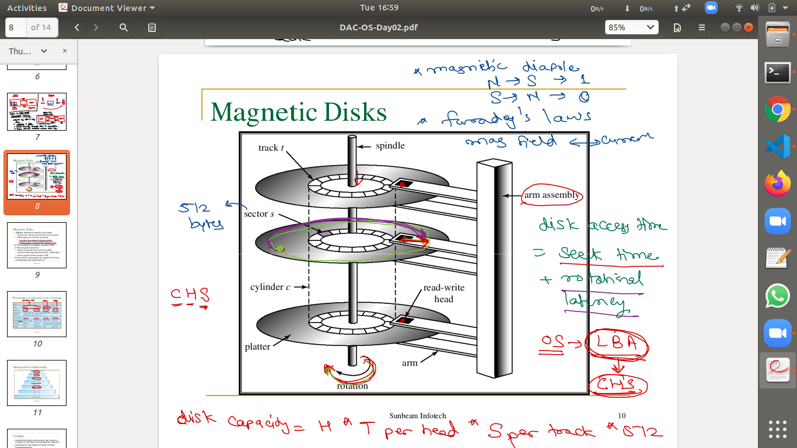

# syllbus
* Linux Commands,
*  Vi editor, 
*  Shell Scripting,
*  Overview of OS,
*  Processes,
*  Scheduling & Synchronization,
*  Memory management, 
*  File Systems,
*  Case Study with Linux System Programming: Process, 
*  Signals,
*  Semaphores & Mutex, 
*  Inter – Process Communication, POSIX Threads

### NOte
1.  linux supportedfile system manager : (its own)ext3,fat,cdfs,ntfs
2.  windows supported system manager : fat,Ntfs,cdfs 
3.  if you want to see liux file system  in windows , use linux reader, ext2Fsd application 

# day4 : OS -FIle System 

## FILE  System 
1. file is collection of data and information on storage device 
*  i.e file = data(content) + metadata(information about file)
- 1.   metadata is stored in inode (FCB)  (FIle Control BLock)
  *  contain Type,Mode,Size,User and Group,Links
  * Timestamps ,info about data blocks
  - where inode is structure 
  - we can view metadata using, where filepath can be directory/file  
  > stat filepath  
- 2. File data is stored in 
  *  we have 3 types of file stytem : NTFS,FAT,ext3 
  * where  file system is the way of organizing file in disk
2. **File System is divided in 4 blocks** ,which are
- 1. **Boot block/Sector**
  *  contains bootstap laoder 
  *  GRUB (grand unified bootLoader) for linux 
- 2. **super block / Volume Control Block**
  * it contains  info about partition, i.e remaining sections,
  * it contains metadata, 
  * total no of data block present in disk space(data block) is done in super block 
    + no of free data blocks
    + no used data blocks
  * there are four methos/ways by which information about free dta blocks can be kept inside super nblock referred as "free space management mechanism" 
  + 1. bit vector
  + 2. liked list
  + 3. counting 
  + 4. grouping   
  * like label of storage, storage info , used, free space
       
- 3. **inode list block/ Master File Table**
  * inode structure , view using inode command
   * it contains pointer for  each files in  data block
   * even for empty file inode is there   
- 4. **Data blocks**
   *  file data 
* this is general form for file system, no necessary for all file system to be same 
* way of organizing file in filesystem changs FS to FS   
* 


3. FIle System Architecture
+ 1. diagram 

+ 2.  some  System Call API are 
 + 1. open ()
 + 2. close () 
 + 3. read ()
 + 4. write()
 + 5. lseek()
 * called by system so called system calls 
+ 3.   
#### mcq on system call, output type 


4. demo on system call API  
- 1. to copy a file content to another file 
```c++
#include <stdio.h>
#include <unistd.h>
#include <fcntl.h>
#include <unistd.h>

int main(int argc, char *argv[]) {
	int fd, fs;
	char buf[32];
	int cnt;

	//0. check number of command line args

	if(argc != 3) {
		printf("invalid arguments.\n");
		return 1;
	}

	//1. open source file for reading
	fs = open(argv[1], O_RDONLY);
	if(fs < 0) {
		perror("open() failed to open source file");
		_exit(1);
	}
	//2. open destination file for writing
	fd = open(argv[2], O_WRONLY | O_TRUNC | O_CREAT, 0644);
	if(fd < 0) {
		perror("open() failed to open destination file");
		_exit(1);	
	}
	//3. read few bytes from source file
	while( (cnt = read(fs, buf, sizeof(buf))) > 0 )
	{
		//4. write those bytes into destination file
		write(fd, buf, cnt);
	} //5. repeat steps 3 & 4 until end of source file

	//6. close destination file
	close(fd);
	//7. close source file
	close(fs);
	printf("file copied.\n");
	return 0;
}
//terminal> gcc -o filecopy.out filecopy.c
//terminal> ./filecopy.out ~/.bashrc copy.txt          
```
- now command to compile and run file 
```bsh
terminal> gcc -o filecopy.out filecopy.c
terminal> ./filecopy.out ~/.bashrc copy.txt
```
- 1. **FILE POSITION pointer (f_pos)** 
* file position is a pointer maintained for each file
* it  is zero/start when we  open a file
* so when a read/write happens, file position moves by that many bytes(eg 32 bytes)
* for each successive read/write, till the last byte of file, now 
file position becomes zero (0)

- 2.Why OS is written in C,C++, and Assemby language? 
  * Linux/Unix is written in C language
  * 3 choices to write OS , C,C++ and Assembly langauge, as they are Hardware oriented language  
  * Window written in C and C++


- 3. Directory
 * in windows called folder and linux called directory
 * internally it is a file, 
 * that contains directory entries for each syb directory and file in it
 *  4096 byte(4kb) make a one data block, i.e its size
 *  let take a example as /home/sunbeam/.bashrc
 1. sunbeam is a directory , it it also a special file , with inode and data block
 -  each file has a inode and data block 
 -  so we want to open the directory /home/sunbeam/.bashrc
  + here we firs t look in '/' and find home, and then its indoe is taken based on which it goes to home , and search in its data block sunbeam, similary takes sunbeam inode and goes to its data block and find .bashrc  takes it s inode no, use it to open file     
 2. 
 - 1. for each process there is a process control block (PCB), it maintains a table called OFDT  
 - converting  path name to inode number is called namei()
 - 2. so there is a inode table in OS, as if no table, it will be slow to access inode each  table, it contains/load inode no i.e for each file , size,Type
 - 3. to access it/ open a file , it  have a table, open file table(OFT), contains entry of  inode table here to file
   + it contains pointer to file, f_pos=0,
 - 4.  open file descriptor table (OFDT) contains pointer/address to OFT ,also  index  of OFTD to the program called as File discriptor
 
 ### terms 
 - 5. here struct inode : inode tableentry
 - 6. struct file : OFT entry
 - 7. data block size (DBS) :
    - it is the memory block each file contains, with inode , i.e given to OS on creation
    -   its default size, can be seen in format option 
    -   it is by default 4096 bytes (4kb)
    - it means , so we can set it i.e data block for file,
    -  so 4kb in minimum/default size of data block size for each file  
    - so this is a minimum no of bytes each file occupy 
    - so higher the DBS , faster execution , but higher is wastage of space 
    - size of buffer in buffer cache = size of Data block
  
  - 8. so for each swp file , new inode is created, whenwe open a file in Vim editor 
  - 9. on harddisk level, write operation is done on sector basis i.e 512 bytes, it is called physical block size 
  - 10. for each file Data block is called it file level or logical block size
  - 9.  
    > #pragma pack1 
    - related to OS and hardware , not data block
   

1. commands to check 
- memory info 
> free -mh
- cpu info
> lscpu


# day 5


1. a file has boot block,super block, inode block, data block
2. so file logical 1st block mapping to harddisk block , this info is kept in inode
3. as inode contains info about data block, using which we can access respective block 
4. VFS (Virtual File System) ---> file ---> called flat files (i.e shown as contiguous memory file)
+   VFS convert file logical block to disk block using data blocks info in inode
5. to change current file position 
> newpos = lseek(fd,offset,whence)
+ where  fd: file discriptor, offset:  , whence : origin (values can be 0 (SEEK_SET),1(SEEK_CUR),2(SEEK_END) )
+ in c we have 
 > fseek(fp,offset,whence)
6. e.g **MCQ IN EXAM**
- 
0. lseek return new file position  from beginning of the file 
1. > lseek(fd,0,SEEK_SET)
+ take f_pos to start of file
+ in c library to do this, rewind(fp) 
2.  >lseek (fd,0,SEEK_END);
+ takes f_pos to end of file 
+ here lseek returns file size , as goes to last bite
3. lseek(fd,0,SEEK_CUR);
+ its stays in current position, so f_pos doesnt change
+ it will return current file position 
+ same as C function, ftell()

7. f_pos is kept in OFT (Open File Table)
+ if file open 4 times , then 4 time access OFT ,and have 4 f_pos 

8. FIle I/O System Calls
+ open()    ---- fopen() --- returns FIle* 
+ close()  ----  fclose() 
+ read()  ----  fread()
+ write()  ---- fwrite()
+ lseek()  ---- fseek()

9. if dealing with Directory 
> man 3 readdir
- 1. openat()  --- opendir()   --- return DIR*     
   + to read directory 
- 2. getdents() ---- readdir()
  + get directory
- 3. close() --- closedir()
  + close directory

- people prefer using library functon ,not syste mcall
-      

10. file sywstem commands  
+ 1. mkdir()
+ 2. stat()
+ 3. rm cmd --> unlink() 
+ mv cmd --> link and unlink command 


11. **Links in linux (shortcuts)**
* two types of link are there
1. Hard Link (another name for file)
 + another directory entry pointing/ referring to same inode 
```sh
> ln filepath linkpath

terminal> mkdir ~/links

terminal> cd ~/links

terminal> echo "first file." > one.txt

terminal> ls -l -i
## output  having link count 1 
##: 8535450 -rw-r--r-- 1 sunbeam sunbeam 11 Dec 15 09:28 one.txt
terminal> ln one.txt two.txt

terminal> ls -l -i

terminal> ln one.txt three.txt

terminal> ls -l -i

# we can see link count became 3 here 
8535450 -rw-r--r-- 3 sunbeam sunbeam 11 Dec 15 09:28 one.txt
8535450 -rw-r--r-- 3 sunbeam sunbeam 11 Dec 15 09:28 three.txt
8535450 -rw-r--r-- 3 sunbeam sunbeam 11 Dec 15 09:28 two.txt
```
- 1. link command
> ln filepath linkpath
*  ln command internally call link() system function
* as link dir has inode and data block 
*  internally given inode to all link  file, same as first file 
- 2.  rm command
> rm filepath
* internally makes call to unlink system call, it simply deletes directory entry, 
* it decrement link count , if link count becomes zero, then release inode and data block of file
* shown in the below code  
```bash
>  rm three.txt
>  ls -l -i
#output 
## 8535450 -rw-r--r-- 2 sunbeam sunbeam 11 Dec 15 09:28 one.txt
## 8535450 -rw-r--r-- 2 sunbeam sunbeam 11 Dec 15 09:28 two.txt
>  cat one.txt
first file
>  cat two.txt
first file
>  rm one.txt
>  cat two.txt
first file
>  ls -l -i
total 4
8535450 -rw-r--r-- 1 sunbeam sunbeam 11 Dec 15 09:28 two.txt
>  rm two.txt
>  ls -l -i
total 0
>  

```

* cannot create hardlink for directory
- 3. data recovery software,makes directory entry for your file deleted, so recovering data, 
   + its dependent on file system 
   +  here when we delete, inode entry of deleted entry removed, data still there for reuse, till we override data over that data block, then it is completely deleted
- 4. to completely delete a dile i.e non recoverable data , file recovere possible, 
   + for this,override and delete
   + there is shred command in linux for it , it garbage write file and delete it
   + so file can be recovered and data is garbage
- 5. to complete delete , with no file recoverable
  +  use format, can be recovered
  +  if use quick format, can be recovered
  + special utility software, zero utility format , completely 0 every file 

#### by default link count of directroy file is 2 ,
#### by default link count of file is 1 
        

* 2. ****
 + it is good practice to use absolute path of targeted file ,while creating symbolic link
 + same as windows shortcut
 +using link command, it creates a new special file , to keep addr/path of target file ,using
 > ln -s filepath linkpath 
  - internally calls , symlink () system call
+ here link count does not change  , linked file contains path for file, so has memory of 7(name of file n bytes) bytes for the address of target file  
+ if main file deleted, linked file becomes useless
+ here  we can differentiate between targeted and linked file as diffrent file created, different inode,and datablock  , not possible in hard link 
+ if targeted file(one.txt) is deleted, now other linked file becomes like dangling pointer , so no use for them, must be deleted 
```bash
>  echo "new first file" > one.txt
>  ls -l -i
## output
#8535450 -rw-r--r-- 1 sunbeam sunbeam 15 Dec 15 09:55 one.txt
>  ln -s one.txt two.txt
>  ls -l -i
## output
#8535450 -rw-r--r-- 1 sunbeam sunbeam 15 Dec 15 09:55 one.txt
# 8535451 lrwxrwxrwx 1 sunbeam sunbeam  7 Dec 15 09:56 two.txt -> one.txt
>  ln -s one.txt three.txt
>  ls -l -i
## output 
# 8535450 -rw-r--r-- 1 sunbeam sunbeam 15 Dec 15 09:55 one.txt
# 8535452 lrwxrwxrwx 1 sunbeam sunbeam  7 Dec 15 09:58 three.txt -> one.txt
# 8535451 lrwxrwxrwx 1 sunbeam sunbeam  7 Dec 15 09:56 two.txt -> one.txt
>  rm three.txt
>  ls -l -i
## output
# 8535450 -rw-r--r-- 1 sunbeam sunbeam 15 Dec 15 09:55 one.txt
# 8535451 lrwxrwxrwx 1 sunbeam sunbeam  7 Dec 15 09:56 two.txt -> one.txt
>  rm one.txt
>  cat two.txt
# cat: two.txt: No such file or directory
>  ls -l -i
#8535451 lrwxrwxrwx 1 sunbeam sunbeam 7 Dec 15 09:56 two.txt -> one.txt
>  rm two.txt
 
```


12. ### Free Space Management Mechanism
* when a file is requesting for free data blocks , then in which manner free data blocks get allocated for the file and in which  manner info about those alocated data block can be kept inside an inode of that file
* physical data block exist in "data block " called as disk space 
* total no of data block present in disk space(data block) metadata present  in super block  are 
    + no of free data blocks
    + no used data blocks
  * there are four methos/ways by which information about free dta blocks can be kept inside super nblock referred as "free space management mechanism" 
  + 1. **bit vector** : array of bits 
     + in this mechanism,in super block bit vector i.e array of bits get maintained having size = total no of data block present in a data block(disk space)
     + i.e if total no of dataa block = K 
     + size of bit vector = K 
     + each data block has address from 0 to (K-1)
     + if nth bit = 0 ---> nth data block is free
     + if nth bit = 1 ---> nth data block is used
     + when any file is requesting for free data blco under disk allocation method bit vecotr get scanned
     + this mechanism is used with either linked allocation or index allocation 
     + e.g : Extended filesystem  :LINUX 
  + 2. **liked list**
     + in this , linked list of free data blocks get maintained inside data block itself and adress of starting data block in that list can be kept inside a super block
     + this mechanism is used with linked and index allocation
     + e.g :FAT16/FAT32  
  + 3. **counting** 
     + in this mechanism , information about contiguous free data block can be kept in a super block
     + consist : 2 ---->  4 [count] (for block 2 to 5 contiguous free memory)
     * address of starting free data block  ---> count (no of free data blocks exits in a contiguous manner including starting data block)
     + this mechanism used with contiguous allocation 
  
  + 4. **grouping**
     + in this mechanism , group of contiguous free data blocks get maintained and addresses of data blocks i nthat group get stored into the first free data block i nthat group, and address of first group data block can be kept in super block.     


13.  ### Disk Allocation Mechanism 

* three popular mechanism : 
 1. **contiguous(C) allocation**
 + inode contains mapping of logical block in inode with hardisk physical block 
 * **limitation on growing of file**, as no contiguous memory available, even in memory is available on HDD
 * amount of memory  required for file is available but not contiguous this is called      **external /dis fragmentation** 
 + so moving disk block of HDD to make avaialable space contigous is called Defragmentation
 + as memory in C, we can do sequential and ramdom access of memory    


 2. **linked allocation**
 + to remove external fragmentation problem 
 + here each block contains data and pointer to next block, so memory for file is not contiguous 
 + inode contains mapping of logical block in inode with hardisk physical block(start block and end block )
 * so last block can be changed, as file grows 
 *  so here ramdom access is slow
 * eg : FAT system 

 3. **indexed allocation**
 + here, a special block is kept to maintain the information, i.e address of data blocks for a file, this block is called index block , this allocation is indexed allocation   
 * no extrnal fragmentation , but 
 * size of index block , has limitiation , so certain limitation for file to grow 
 * here we can do sequential and random access 
 * example in case of unix File System created by Dennis Richtie 
  + they have index box to keep data block  address, ]
  + here each index block has multiple entries and each entry is a index block , containing actual entries 
  + i.e index block pointing to multiple index block pinting to actual data block , 
  + here mx file allowed 16 GB, and block size = 4kb,   
  + model file system: Ext2/3 --> similar to UFS , having an array of 15 memeber, not 13 of UFS , to create max file size 100GB 
  + so index blocked  creating new index block in UFS , are called single indirect block, double indirect block ... ,
      - as no of indirect block increase ,speed decreases 
      - as small files faster access , larger file slower access   
  + used by Linux (ext3,ext2 )  

14. Journaling
+ file system work in progress, for bigger file , large time req, and power failure there, so system gets down , so previous operation , a journel / log file is maintained here ,and how work is done, file system maintains log of each activity, so when system reboot file system refer the log file, and file system corruption chances reduces .  

# day5 afternoon session 

1. to check storage
> sudo fdisk -l
2. bebug 
> sudo debugfs path 

3. free space management algorithm 
+ super block maintains info about free inode , free data block 
+ there are 4 algorith of free space management : 
* 1. bit vector/map 
  + 4kb size of bit vector 
  + 
* 2. linked list mechanism 
  + each free block contains address of next free block   
* 3. index mechanism 
  + start block contains address of all contiguous
* 4. counting 
   + no of free block are counted and listed

 4.   general structure of ext2/ext3 

 * 1.  
 > sudo mkfs -t ext3 /dev/sdb1 

* 2.  ext3 in partition has a block group which contains 
  + 0. Boot block 
    + common for all blocks in one partition 
  + 1. super block
     + disk info
  + 2. group descriptor
     + current group info
  + 3. inode bit vector
  + 4. database bit vactor
  + 5. inode library
  + 6. data blocks

 5. ext3 = ext2  + journaling  
  * to avoid inconsistency ,so FS doesnt get corrupt, due to power failure, solution is journaling i.e logging of FS activities , and match them on power on 
  * for this use journal /log file,
  * for file system checks, we use tool 
  > fsck /dev/sdb1
    +  here check all directories,inode,and databases, this is slow proces
  * journalling speedup checks by limiting checks to currently operated files and directories 

  ### IMP for MCQ : 6
6. for Disk Management 

* Disk access time = rotational latency + seek time
* when accessing disk , if following request are pendlng ,80,20,90,10,40,65,5
* my hdd arm pointer is at 30 , and radius from 0 to 100
* for this we have disk sheduling algorith
+ 1. **FCFS : first come first served**
  - follow same order of request order 
 * 30 -> 80 ->20 -> 90 -> 10 -> 40 -> 65 -> -> 35 
 + so total seek distanxce = 50 + 60 + ... = 395 
+ 2. **SSTF : Shortest Seek Time First** 
  - from current location of pointer , go to the nearest request
  * 30 -> 35 -> 40 -> 20 -> 10 -> 5 -> 65 -> 80 -> 
  + T.S.D  = 5 + 5 + 20 + ....= 130
+ 3. **Scan /Elevator Alorithm** 
  *  magnitec tip keep moving from 0 to max , and access request as they come 
  *  30 -> 35 -> 40 -> 65  -> 80 -> 90 -> 100 -> 90 -> ....->30-> 20 -> 10 ->5 
  + T.S>D = 
  * this algorithm is used in LINUX , by IO sub system 
+  4. **Circular SCAN** 
   * here magnetic pointer moves from  0 to max, then jumps back to 0 
   * 30 --> 35--> 40 --> 65 --> 80 --> 90 --> 100 ---> (back to 0) --> 5 --> 10 --> 20

+ 5. **Look Algorithm**
  * implementation policy of SCAN/C-SCCAN to conserve power /energy 
  * move as a SCAN or C-SCAN, only when request pending ,its implementation policy 


7. Process Management 
* galvin book chapter 3,4,5
1. Process is a program in execution 
2. 

3. OS data structures for process execution 

* 1. Job Queue / Process table/ Process List 
  + contains all processes(PCB) in system
* 2. Ready Queue/ Run Queue 
  + all processes ready to execute on cpu 
* 3. waiting queue(s)
  + waiting queue per device for per syncronization object
       
 
 #### synchronizing object in java used by synchronized keyword is : monitor

4. **Process Life/State Cycle (PLC)**
 * running process is PLC
- 1. JOB-QUeue (new process initialized here)
 *  starts at Job-Queue /New --> initialized then added to
- 2. Ready Queue
 *  (ready for execution process)
 * here cpu dispatch i.e (process goes from ready to running state) takes place  
- 3. Running queue 
 *  now CPU scheduler puts it in running state, it consumes time here, based on Round RObin algo
 * if interupt occur, process go back to ready state ,
- 5. Waiting Queue 
 *  if there is I/O operation / syncronization operation in Running state, process goes to waiting Queue (here P is sleeping)
- 6. once I/O operation finished, P go to Ready state, and then go to running 
- 7. now after running process get Terminated  


5. Linux Process State 
* they are 
- 1. **R state** 
  + mean (process is Ready or Running) 
  + indicated by (TASK_RUNNABLE) 
  + if process has i/o request or syncronization operation 

- 2. Linux(process waiting) has types
  * 1.**S state , its Interuptable sleep**
   + request not complete , but by sending signal, process  in wait can also forcebly awaken, by interrupt
   + it has macro  TASK+_INTERRUPTABLE  
  * 2. **D state its Un-Interruptaable sleep** : 
    + also refer as dormant state
    +  request not complete , but by sending signal, process  in wait cannot be forcebly awaken, by interrupt
    +   it has macro  TASK+_UNINTERRUPTABLE 
  * 3. process suspended 
    + process in stop state, using stop() signal(Cltr + S can be used for this in VIm and to awaken Cltr + Q ) 
    + macro TASK_STOPPED
- 3. **Z state(process terminated)**
   + here we use exit 
   + macro TASK_ZOMBIE  


6. commands to check state of process
> ps -e -o pid,state,cmd
* to let a process go to background , use Cltr + Z
  > bg
* to bring it back to foreground
> fg

7. CPU Scheduler
* decides next process to be executed on CPU 
8. CPU Dispatcher
* dispatch the process on CPU i.e load its execution context (CPU regualr values) into CPU 


7. Process Creation(PC) 
+ 1. PC depends on Operating System ,its system call 
 * example 
  + 1. in windows --> CreateProcess()
  + 2. in Unux --> fork()
  + 3. in BSD UNIX --> fork(), vfork()
  + 4. Linux ---> fork(),vfork(), clone()
+ 2. we are gonna use fork()
  
8.  **fork()**
* creates  a new process by duplicating the calling process.  The
new process is referred to as the child process.  The  calling  process
is referred to as the parent process.
* The child process and the parent process run in separate memory spaces.
*The child process is an exact duplicate of the  parent  process  except
for the following points:
*  The child has its own unique process ID, and this PID does not match
 the ID of any existing process group (setpgid(2)) or session.

+ On success, the PID of the child process is returned in the parent, and
 0  is returned in the child. 
 +  On failure, -1 is returned in the parent,
  no child process is created,

* 1. basic structure  
 ```c++ 
 #include <sys/types.h>
 #include <unistd.h>
// pid is type def on int
//   pid_t fork(void);

main(){

  int ret;
  ret = fork(); 
  // it successful, return 0 to child process and pid no to pCB and parent 

printf(); // run by parent and child
  if( ret == 0) {
    // true for child process
  } else{
    // true for parent 
  }

}

 ``` 

* 2. basic demo 
 ```c++
#include <stdio.h>
#include <unistd.h>

int main() {
	int ret;
	printf("program started.\n");
	ret = fork();
	printf("fork() returned: %d\n", ret);
	printf("program completed.\n");
	return 0;
}

// terminal> gcc -o fork.out fork1.c
// terminal> ./fork.out

 ```

- on bash 
```bash

> gcc -o fork-file1.out fork-file.c
> ./fork-file1.out 
program started.
fork() returned: 19890
program completed.
fork() returned: 0
```

3.  demo with different  tasks for parent and child process
* use to run process concurrently ,independent process  
```c++
#include <stdio.h>
#include <unistd.h>

int main() {
	int i, ret;
	printf("program started.\n");
	ret = fork();
	printf("fork() returned: %d\n", ret);
	if(ret == 0) {
		for(i=0; i<300; i++) {
			printf("child: %d\n", i);
		}
	} else {
		for(i=0; i<300; i++) {
			printf("parent: %d\n", i);
		}	
	}
	printf("program completed.\n");
	return 0;
}
// terminal> gcc -o fork.out fork2.c
// terminal> ./fork.out
```

- 5. to see process info 
  *  ps displays information about a selection of the active processes.  
  * count of all process running
  >  ps -e | wc -l
  * here -o : User-defined format
   + pid : 
  > ps -e -o pid,state,cmd
  * to see child and parent pid
  > ps -e -o pid,ppid,cmd

  >  ps -e -o pid,ppid,state,cmd
```cmd
          -e :Select all processes.  Identical to -A.
   here   -o : User-defined format
 KEY   LONG         DESCRIPTION
       c     cmd          simple name of executable
             state        Process state       
       C     pcpu         cpu utilization
       k     utime        user time
       o     session      session ID
       p     pid          process ID
       P     ppid         parent process ID
       s     size         memory size in kilobytes
       U     uid          user ID number
       u     user         user name
       y     priority     kernel scheduling priority

```

#### MCQ:Question
- 6. demo for orphan process
*  init or systemd process id 1
* process with process id 1 is init in older linux , and systemd in newer linux
* when parent process is terminated then the child process is called orphan process , and the process is taken by init  process through , a reaper process which is at    /lib/systemd/systemd --user
* ownership of orphan process taken by init process pid 1
* if child process completes earlier then parent , we get [fork2.out] <defunct>

```c++
#include <stdio.h>
#include <unistd.h>

int main() {
	int i, ret;
	printf("program started.\n");
	ret = fork();
	printf("fork() returned: %d\n", ret);
	if(ret == 0) {
		for(i=0; i<30; i++) {
			printf("child: %d\n", i);
		}
	} else {
		for(i=0; i<15; i++) {
			printf("parent: %d\n", i);
		}	
	}
	printf("program completed.\n");
	return 0;
}

// terminal> gcc -o fork.out fork2.c
// terminal> ./fork.out

```


7. demo of Zombie state
* if child process completes earlier then parent , we get [fork2.out] <defunct>, i.e child process is in zombie state
* as child process need a confirmation from parent process, to terminate , by system call , wait ()
```c++
#include <stdio.h>
#include <unistd.h>
#include <sys/wait.h>

int main() {
	int i, ret, s;
	printf("program started.\n");
	ret = fork();
	printf("fork() returned: %d\n", ret);
	if(ret == 0) {
		for(i=0; i<15; i++) {
			printf("child: %d\n", i);
			sleep(1);
		}
		_exit(3); // child exit status = 3
	} else {
		for(i=0; i<30; i++) {
			printf("parent: %d\n", i);
			sleep(1);
			if(i==15) {
				wait(&s); // get exit status of child process from its pcb and release pcb of the child.
				printf("child exit status: %d\n", WEXITSTATUS(s));
			}
		}	
	}
	printf("program completed.\n");
	return 0;
}

// terminal> gcc -o fork.out fork6.c
// terminal> ./fork.out


            

```


8. to avoid Zombie state using wait

```c++
#include <stdio.h>
#include <unistd.h>
#include <sys/wait.h>

int main() {
	int i, ret, s;
	printf("program started.\n");
	ret = fork();
	printf("fork() returned: %d\n", ret);
	if(ret == 0) {
		for(i=0; i<15; i++) {
			printf("child: %d\n", i);
			sleep(1);
		}
		_exit(3); // child exit status = 3
	} else {
		for(i=0; i<30; i++) {
			printf("parent: %d\n", i);
			sleep(1);
			if(i==15) {
				wait(&s); // get exit status of child process from its pcb and release pcb of the child.
				printf("child exit status: %d\n", WEXITSTATUS(s));
			}
		}	
	}
	printf("program completed.\n");
	return 0;
}

// terminal> gcc -o fork.out fork6.c
// terminal> ./fork.out


            


```