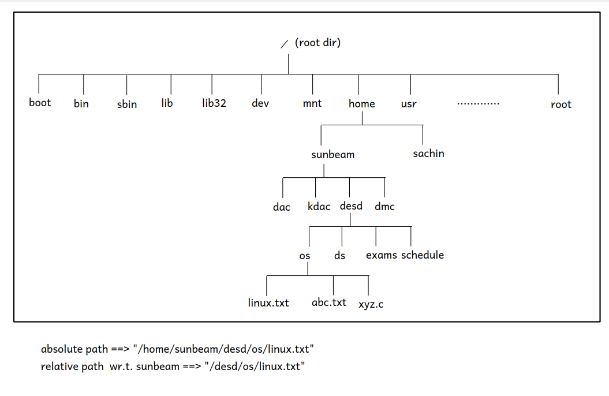

# day1

1. OS
- it is a interface between user and hardware 
- core of OS is Core OS/Kernel : 
  * it doing minimul basic functionalities, like 
   - 1. Process management 
   - 2. file I/O managaement
   - 3. memory management
   - 4. CPU Scheduling 
   - 5. hardware abstraction
  * OS also does extra functionalities like 
   - 1. User interfacing
   - 2. Networking
   - 3. Protection and Security
  
2. Linux
- linux is inspired by unix ,which was designed by denis richtie and in 1970
- unix is based on
    * file control subsystem (I/O management) and 
    * process control sub system
- its  logan is : 
* **"file have spaces and process have lines "** 
 -  i.e everything is a file , examples of special files are
    + data file, directory,pipe,socket,links(shortcuts),
    + block devices , where 1 sector = 512 bytes,
    + char devices , byte by byte 
 - process   

- system calls : 
 + A system call is a way for programs to interact with the operating system.
 +  A computer program makes a system call when it makes a request to the operating system's kernel.
 +   System call provides the services of the operating system to the user programs via Application Program Interface(API) 

- software interrupts

## OS Learning

1. end users
 - commands

2. administrator 
 - installation
 - shell scripts

3. programmer
 - system calls

4. designer
 - OS Internals 


## Linux Shell

1. Shell takes input from terminal i.e from end user and runs system call i.e get them executed by kernel  and shows output on terminal 
 - terminal is the window we give input and get output ,
 - internally terminal has shell 
*  two types of shell 
- 1. GUI Shell
   + in windows: explorer.exe
   + Linux : GNOME or KDE
- 2. CLI Shell 
   + windows: cmd.exe, POWER shell  
   
   + in linux : first was bsh then changed to bash (<u>b</u>ourne <u>a</u>gain <u>sh</u>ell)
      + csh/tcsh
      + zsh
      + zsh
      + ksh --> Korn shell(unix)

2. LINUX folder structure 
- 
1. in boot 
- linux kernal name : vmlinuz
- linux boot loader : grub

2. in bin 
- executables/commands
3. in sbin 
- system commands(admin)
4. in lib 
- contains libraries (.so) and device drivers(.ko)
     +  where ko: kernel objects
5. usr
- contains all installed programs/softwares

6. etc
- contains hardware and software configuration files  of: system,application , hardware 
  + source.list

7. dev
- contains device files(char and block)

8. proc
- for monitoring /dynamic config
- kernel window

9. sys 
- for device drivermanagement 


10. tmp
- its temporary file system(auto lost when shutdown) 

11. mnt
- mount point (to see other file system)
- optional 
- can mount cp or hdd using mount command
 > sudo mount /dev/sdb1 /mnt
 - sbd : pendrive 
 - sda : pc storage 
 - to unmount it 
 > sudo umount /mnt

12. root
- directory for admin user (i.e root )
-  

13. home 
- contains all users data like 
 + sunbeam
 + root 
- if username is sunbeam ,then it home directory is
> /home/sunbeam 


14. The table below shows the section numbers of the manual followed by the types of pages they contain.

- 1.    User/Linux/ Executable programs or shell commands
- 2.    System calls (functions provided by the kernel)
- 3.    Library calls (functions within program libraries)
- 4.    Special files (usually found in /dev)
- 5.    File formats and conventions eg /etc/passwd
- 6.    Games
- 7.    Miscellaneous (including macro packages and conventions), e.g. man(7), groff(7)
- 8.    System administration commands (usually only for root)
- 9.    Kernel routines [Non standard]

## Linux Commands: 

1. Linux version
>  uname -a

2. List commandds
```shell
terminal > ls -l
# size of directory
terminal > ls -l -h 
```
3. command to show  shell 
```bash
 >  ls /bin/*sh
 > /bin/bash  /bin/dash  /bin/rbash  /bin/sh  /bin/static-sh
```
4. to change shell [NOT RECOMMENDED]
> chsh
- i.e change shell 

5. check working shell
>  echo $SHELL

6. to check boot folder content
> ls /boot
7. to get kernel/cpu info
> cat /proc/cpuinfo

8. to create directory
-  path -- w.r.t current directory
> mkdir <directory-name>
- it does'nt start with '/'
  
- path with wr.t to absolute path, 
> mkdir /home/sunbeam/<directory-name>
- start with '/' : are absolute path

9. for Relative path, Special directories are 
- 1. . : current directory
   > ./a.out
- 2. .. : 
>
- 3.  : 
>


10. list contents of current directory
 > ls  
 e.g :
 >  ls /boot
 - list content of your home directory / long view 
 > ls -l ~
 + where -l --- long listing (detail view)
 + contains type, mode/permissions,links,user,   group, size,modified timestamp,name
 

11. to change directory
+ from absolute or relative path
 > cd  commands
 - as not start with '/', so relative
+ 
 
12. to remove empty empty directory
> rmdir <directory-path>
- to delete contents in directory
> rm -r dirpath
13. cat command to create and insert file content
> cat > <filename>.txt
eg:
```bash
 cat > fruits.txt
 mango 
 banana
 # use cltr + D to come out from writing
 ```
- to view content of the file
> cat <filename>.txt

14. copy given directory to a destination directory
> cp -r <src> <dest>

15. move file into given directory
 > mv <filename> <dirpath>
- also use for rename a fle 
 > mv -r <filename>.txt
- In linux file/directory starting with "." is hidden
- to see hidden files
 > ls -a 
- to see hidden file content 
 > cat .fruits.txt 
 
16. IO redirection  
```sh
> ls -l -a 
# output is shown on terminal 
 # now to save output in file 
> ls -l -a > out.txt
# output copied to file  

> cat out.txt 
# we can see output of ls 

# for sorting 
> sort 
nitin
amit 
sandeep
nitin
amit 
nitin
nitin
sandeep

## INPUT redirection
# input(stdin) is taken from file and output on terminal
>  sort < fruits.txt

## OUTPUT redirection
# read output from, a file and writing in another file
> sort <  fruit.txt > result.txt

# for revrse order sorting
> sort -r <   fruit.txt

## ERROR redirection 
# invalid option -x 
> sort -x <   fruit.txt

# error output is shown on terminal
# output is shown on terminal (stderr)


# number of standard 
#stdin = 0,
# stdout = 1,
# stderr = 3

# so to write error output
> sort -x 2> err.txt

```

17.to give one command output to other commands  
- for word count 
```bash
> wc

hello sunbeam
here
# Cltr + O 
      2       3      20
#   lines    words   charcters

# to give one command output to other commands
> ls -l | wc
#left command (ls -l) output is given as input to right command(wc)
```

## Lab commands
1. LinuxFileSystemStructure
our application of Tree Data structure


2. Lab commands I
```bash

# 1.  to clear screen 
> clear
# or use Cltr + L 

# 2. to change dir to home directory 
> cd ~
# 3. to show current working dir
> pwd

# 4. create a  directory and a sub directory,  
# where -p: 
>   mkdir -p  os/linux_commands

# 5.changing directory 
  # - from inner directory to outer
  # use '..' + outer directory
  > cd ../../..

  # to go to root dir 
  > cd /
  # to go to the previous dir
  > cd - 
  # stay in current dir
  > cd .
  # go to parent dir
  > cd .. 

# 6. list commands 
     # list content/file names in dir
     > ls
     # list  content/file with hidden, and total data block allocated
     > ls -l -a
     
     # shows file/content info
     # drwxr-xr-x 3 sunbeam sunbeam 4096 Dec 11 14:51 ..
     # contians : 1)type-of-file :--> d: directory, -: for regular -
     #      2) wxr: are read and write permission
     # -l : to be displayed as a list
     > ls -l
     
     # here -s: show no of data block got allocated
     > ls -l -s
     
 

# 7 to make multiple  subdirectory in a dir
     > mkdir /one /two /three /four 
     
     # make sub directories recursivly
     > mkdir -p four/five/six
     # use :  -R to display list sub-directory recursively
     > ls -R four/

# 8 . cat commands 
  # to create and isnert in a file 
   > cat > file1.txt
    suraj
    raj
    ram
    # use Cltr + D
     
   #  to show the file 
   > cat file1.txt

   # now if we use same cat command , content get overwritten
   > cat > file1.txt

   #to display in reverse order
   > tac > file1.txt

   #concat multiple files
   >  cat file2.txt file3.txt

# 9 to delete a file or a directory 
>  rm -r <directory>/
>  rm -r <file-name>
# 
```

1. list command syntax
>   ls [OPTION]... [FILE]...
- where 
 + ... indicate : multiple arguments allowed 
 + FIle: IO file , if not given , takes pwd  

3. Lab Linux commands 


```bash
# copy all text files to destination 
# * : used to describe as all, if used with extension so all files of that type 
> cp ./*.txt ./../../../../
# using pipe to give output to 2nd command after | 
> cat 5.txt | less
#  Sort based on ASCII value
> > sort  numbers.txt | less

# to sort number in file numerically
> sort -n  numbers.txt | less

# sorter and unique 
> sort -n   numbers.txt | uniq

# head print 10 lines by default , we can set no of lines
> cat numbers.txt | head  -<number of lines>
> cat numbers.txt | head  -2

# tail to print from  last
>  cat numbers.txt | tail -<number of lines>

# can use tail and head together , pass one output as input to other
> cat numbers.txt | tail -15| head -5

#  -d : delimeter on basis on which it cut 
# -f1: prints 1st field 
> cat sunbeam.txt | cut -d " " -f1
> cat sunbeam.txt | cut -d " " -f2

# -i:display inode no 
> ls -i -l

# we can cut any list , and give which fields , like f1,f2
> ls -i -l | cut -d " " -f1,

# path of binary
> echo $PATH 

# tr : commands translates from one char to another
> echo $PATH | tr ":" "\n"

# tr : translates all small case into capital 
>  echo "Suraj" | tr "a-z" "A-Z"

> echo "Suraj" | tr "a-zA-Z" "A-Za-z"
- sUraj from Suraj


# chmod use for change permission , where u: user,g: group , o: other
# where w: write, r: read,x: execute 
# using u+x , u-x, we can change permission
> chmod g+w india.txt 
> chmod u+rwx india.txt 
> chmod o-rwx india.txt 
> chmod g-rwx india.txt 

# r: apply ls command
# w: we can create files and sub directory
# x: we can apply cd command on it 

# there are two formats/method by which we can change mode bits of a file i.e 
# we can assign /remove access permission : 
# 1. human readable : r,w,x 
 used as 
> chmod +rwx filepath
> chmod -rwx filepath

# 2. octal formats : 
# read : 4, write : 2, execute : 1
# first digit : octal digit start with zero , so lading 0 indicate octal contant
# second digit : access permission for user/owner
# third digit : access permission for group members
# fourth digit : access permission for other members
> chmod 0641


# create a alias for command , it is for  session 
> ls -l -a -i -s
# alias command: where l = alias
> alias l="ls -l -a -i -s"
# execute alias l 
> l
# command to remove alias 
> unalias l
```


# day2 

## Agenda 
1. Advanced Linux commands
2. Shell features
3. Shell script
4. File and File system 


# notes 

1. **Shell wild card character**
 *: it is any number of any character 
 ? : for single character

2. $? : a special shell variable , to show if your previouse commands succeeded or failed
- if $? : 0 --> success,
-  !0(not zero) like 1 to 255 ---> fail
> echo $?
- i.e $? ==>  exit code of previous command / program 
  


## Linux commands part II


1. to create a file
> touch f1.txt f2.txt d.txt
- to look only .txt file
> ls *.txt
2. txt file starting with f
> ls f*.txt

1. Shell wild card character
    + *: it is any number of any character 
    + ? : for single character
    + for .txt with 3 character starting with f
    >  ls f???.txt
    - output : file.txt
    >  ls f?.txt
    -  output f1.txt  f2.txt

 4. cat commands 
  - if no file path given , takes string as input  as print output
  > cat 
  - to create insert in a file 
  >  cat > text.txt
  - to append the  same file 
  > cat >> text.txt

  - using combination 
  > sort < text.txt > out.txt || err.txt

 5. no of user connected 
> who

 6. $? : a special shell variable , to show if your previouse commands succeeded or failed
 -  if $? : 0 --> success, !0(not zero) like 1 to 255 ---> fail
> echo $?

 7. test commands check a condition based on expression
   > test 12 -eq 12
   -  now we can check if it failed or success
   > echo $?
   -  where eq: equal , gt: greater than 
   
8. for running cx program in shell 
```sh
terminal> cat > hello.c
#include <stdio.h>
int main() {
	printf("hello world!\n");
	return 0;
}
# ctrl+D

terminal> gcc -o hello.out hello.c
terminal> echo $?
# output=0 -- success -- condition true
```


9.  logical nesting of commands
- 1. && 
  - if first command successful then, run second command
   >  test 12 -eq 12 && date
   - successfully run date 
   >  test 12 -gt 12 && date
   - failed to run date
- 2. ||
   - either 1st or 2nd command 
#test command have : -d : to check if it is a  directory
   > test -d f1.txt && ls f1.txt
   - it only 1st command success, then run second 
   > test -d fruits.txt || ls f1.txt
   - here if 1st command fails ,run second command
- 3. & (asynchronous command execution )
  > 
10. find command , is to find files , so path , by name, file name 
> find ~ -name "file.txt"

 11. open file from shell
> firefox
- here firefox will be opened , but shell prompt is not available 
- shell is waiting for firefox to complete 
- once firefox is closed, shell 
- so for asyncronous use
> firefox&


 12. Regular Expression 
 - have 3 commands type 
  > grep
  > egrep

 - **regular expression Wild card characters**
 - 1. ^ : starts with the character
 - 2. $: end with the character
    - applicable for regular expression command
 - 3. [] : any single character , search is given specific range , called scan set 
 - 4. . : search for any  single character 
 - 5. / : to remove special character, or use fgrep
 - 6. [^...] : inverse of scan set , i.e outside this range ,any single character  accepted
 -  
```bash
> cat > food.txt
this
biscuit
isnot
tasty,
but
that
cake
is
really good.
# ctrl+D

# to print a pattern in  a file , like is in a file 
> grep "is" food.txt

# for is in beginning, use carrot character : '^'
> grep "^is" food.txt

>  grep "is$" food.txt

> grep "^is$" food.txt
```

- other wild cards 

```bash
> cat > bug.txt
bag
beg
big
bug
bog
bg
b*g
# ctrl+D

# here : . --> indicates only one character between b and g
> grep "b.g" bug.txt

# here [a-z] --> valid option to appear between b and g 
> grep "b[a-z]g" bug.txt

# search is specific range indicated by : []
> grep "b[aou]g" bug.txt

# to print "b*g" : i.e special character
- use / to remove special character 
> grep "b\*g" bug.txt

# for no meaning of special character,search word as it is, so no wild card meaning 
> fgrep "b*g" bug.txt
```
 13. Extended Regular expression character, use egrep
- grep -> only basic wildcard characters
- egrep --> basic + extended wildcard characters
- wild card character in Regular expression 
+ 1.     * : zero or more occurence of  previous character or group 
+ 2.     + : one or more occurence prev char /group
+ 3. ? : 0 or 1 occurence 
+ 4. {n}, {m,n},{m},{n} : number of occurence of prev char /group 
+ 5. (w1|w2|w3) : find a word form w1,w2,w3
 ```bash
terminal> cat > big.txt
bg
big
biig
biiig
biiiig
biiiiig
biiiiiig
biiiiiiig
#ctrl+D

# zero or one 
>  grep "bi*g" big.txt
- fail 
## Extended category 
# one or none
> egrep "bi?g" big.txt
# 1 or more
terminal> egrep "bi+g" big.txt
# exactly 3
terminal> egrep "bi{3}g" big.txt
# 3 oor more
terminal> egrep "bi{3,}g" big.txt
#3 or less than 3
terminal> egrep "bi{,3}g" big.txt
# between 3 and 5
> egrep "bi{3,5}g" big.txt
 
# for wit or  condition from  multiple values using | 
>  egrep "(cake|biscuit|good)" food.txt 
 ```

 14. Regular Expression : flags
 - 1. -c : count 
 - 2. -n : gives  line search character found 
```bash
> grep -c "printf" hello.c
> grep -c "b[a-z]g" big.txt

# * zero or more occurence of  previous character or group 
terminal> grep -n "big" *.txt

terminal> grep -R -n "big" 
# to check in all directory
> grep -R -n "goto" ~ 
#  grep,  recursively all files, - print line , check expression , file path    
```


 15. build regex
 - 1. for 10 digit mobile number, regrex
   > "^[0-9]{10}$"
   - i.e start ^  [scan-set] {no on character}  end $

 
 ## Shell Script using VIM Editor 
 ### 1.  VIM Editor  related
-  Vim Editor worlds best editor for terminal
- question on vi editor : copy on VI editor
- started as VI editor,, developed by Bill Joy 
- now,we use Vim editor  :VI improved editor 
1. **VI editor modes :** 
 - 1. command mode
  - press "Esc" 
 - 2. insert (edit)
  - to insert =  press "i" 
 - 3. write/save =  :w
 - 4. quit = :q 
 - 5. write and quit =  :wq
 - 6. quit without saving   :q!
  #### cltr + s suspend and cltr + q resume 
 - 7. :ls
   - to list VI files 
 - 8. :next
 - to jumb forward to other files in VI 
    > :3next
    - to jump forward by 3 files
 - 9. : prev
   > :2prev
   - to jump back by 3 files , can be seen by :ls
 - 10. : wqa 
    - write and quit all
 - 11. -O : open  two files vertical tab  
    > vim -O one.h one.c 
 - 12. -o : open two files in horizontal tab
    >  vim -o one.h one.c
 
 - 13. Cltr+ W+W 
   -  switch between tabs use

 - 14.   to copy content  in file 
  ```bash
  use 2yy
  take cursor to dest , press p
  ```

 - 15.  to open VIM editor 
  > vim <filename.extension>

2. **commands for Setting/customize VI**
```bash
# set tab stop : how many spaces 
: set tabstop = 8
# set spaces on press of shift
: set shiftwidth=4

# no color
: syntax off

# color
: syntax on

# write and quit all files
: wqa 

# to open two files, side by side
: vim -o one.c header.c

# set nowrap 
: set nowrap

# set write all default
: set autowriteall
```

3. **for specifying setting only once , for VI** 
.vimrc file : content/commamds in it , are auto executed, when vi editor starts
- located in user's home directory
```bash
# to open .vimrc file 
> vim ~/.vimrc

# to insert 
: i 
 set number
 set tabstop=4
 set shiftwidth=4
 set autoindent
 set nowrap
 set autowriteall
 syntax on 

 
: wq 
```

4. **data Manipulation Commands in VI editor** 
- 1. to copy  
  * yy --> copies current lin 
  * 4yy --> copies  4 line from cursor
  * :6,9y ---> copies line 6 to line 9
  * yw --> copies current word (from cursor)
  * 3yw --> copies 3 words from cursor
- 2. to paste
  * p ---> paste from the cursor

- 3. u ---> undo
  - for undo   
- 4. cltr+R ---> redo
  - for  redo 

- 5. to cut 
  * dd --> cut current lin 
  * 4dd --> cut  4 line from cursor
  * :6,9d ---> cut line 6 to line 9
  * dw --> cut current word (from cursor)
  * 3dw --> cut 3 words from cursor 
  - using cut we can delete too

- 6. to find 
  - use / and filename to find 
    > Esc ---> :/word
    - n ---> to find sub-sequent occurences
  > :/printf
  - to find printf
- 7. to find and replace use 
  > * Esc --> :%s/find/replace/#g --> replace all occurrences
  > :%s/find/replace
  > :%s/printf/scanf
 - here can use #g for global at end 
  > :%s/printf/scanf/#g
 
- 8. Indentation 
   >  Esc --> gg=G
	* gg --> first line
	* G --> last line
	* = --> Indentation
- 9.  Go to line
	> Esc --> :34
	- Jump to line 34
  
#### 10. how do you run  bash command from VI editor , use Esc --->  :!command
> Esc --> :!command
- to compile c file 
> Esc ---> :!gcc -o hello.out hello.c

```bash
# to compile and run c program from Vim editor
Esc --> :!gcc -o one.out one.c

Esc --> :!./one.out

```
###  2.  Shell Script (SS) 

1. Shell script is collection of shell commands along with programming constructs lijke if-else,loop,case,functions.
2. it is interpreted language
- line by line execution 
- 1.  pros : 
   * simplified syntax
   * quick development
- 2. cons : 
   * fixed syntax (not free-form),not required spaces can give error
   * tough debugging 
   * slower execution ,based on system (nowadays configure of pc better, so execution speed increased)

3. Applications of SS i.e .sh files
- 1. Installers
    +  .sh files , installion  command files can be made  
- 2. Administrator   
    + to fix some issues, having common set of instructions, use .sh file, so can be used by multiple  
- 3. Automation job
    + like testing job


 ### 3.  Shell Scripts demo
-
1. demo to write and  run shell script file 
- simplest shell script is set of commands
- the first line contains path of shell program to execute this script followed by #!
- when script is executed (./hello.sh), then OS invoke the shell program to execute this script 
- 1. create SS 

```sh
> vim hello.sh

#!/bin/bash
#the first line contains path of shell program to execute this script followed by #!
#when script is executed (./hello.sh), then OS invoke the shell program to execute this script 
cal 
uname -a
who 

# Esc ---> :wq
```
- 2. to run SS using bash 
  - used during development 
> bash hello.sh
- 3. to give execute permission to SS file 
> chmod +x hello.sh

- 4. now we can execute it using ./
  - using during production
> ./hello.sh

- 5. by default run with current shell(if sheband line is missing)
   - so run only by bash shell , for this  in VIM , opening our .sh file 
     + first line of code must be  
   > #!/bin/bash
   - this command is known as Shebang line
   - it starts with # i.e comment for shell interpretor (/bin/bash)
   - so bash skip this command, but OS reads this line as its first line, as we used #! , and execute it   
   - the first line contains path of shell program to execute this script followed by #!
   - when script is executed (./hello.sh), then OS invoke the shell program to execute this script 

#### Note : 
- 1. on Linux , group are created, which contains number of users,and those not in group are other 
```bash
# so permission is shown in terminal as 
  rwx   rwx    rwx 
  user  group  other

> rw-r-----
# now change permission use chmod 
```      


2. demo 2 on shell varaible and operation 
- shell variables created as 
> var=value
- to print variable 
> echo "$value"

- command substituation
> 

```bash 
#!/bin/bash 

#while assigning value to variable do not use dollor
#no space before/after assign operator 
num1=101
num2=5
# -n : skip trailing new line 
echo -n "Unix is simple. "
echo "It need a "
# -e  to enable escape sequence
echo -e "Unix is very  \n user friendly"
# to access/read value of variable use $
echo "num1 value is $num1"
echo "num2 value is $num2"
# only integer arithmetic possible in shell 
# for expression use expr compulsort 
# using space between variable expression compulsory
expr $num1 + $num2
# traditional syntax, use backquote `` to compute and store, command substitutation or command expansion  
# can use var=$(command) also 
result=`expr $num1 - $num2`
echo "sub is $result"

```

3. calculate area of rect using shell 
- scale ---> for decimal points in result of expression 
- bc --> indicates basic calculator for floating point calculation,
   + now bc prints on screen 
- read : read input from user   
```bash
echo "2.34 / 2"|bc

echo "scale=3;2.34 / 2"|bc
```

```sh
 #/bin/bash
 
 #calculate area of rect
 
 echo -n "enter length: "
 read len
 
 echo -n "enter breadth: "
 read br
  
  area=`expr $len \* $br`
  
  echo "area $area"
  
  echo -n "enter radius : "
  read rad
  
  # for floating point calculation, use bc --> i.e basic calculator 
  # with  we can also use scale , no do decimal points it should be  accurate
  area=`echo "scale=4; 3.1415 * $rad * $rad"| bc`
  echo "area of circle : $area"
  
```

4. code for leap year in shell
 * -eq --> equal to , -ne --> not equal to 
```sh
 #!/bin/bash
 
 echo -n "enter year : "
 read y
 
 # c--> y%4==0 && y%100!-0 || y%400==0
 if [ `expr $y % 4` -eq 0 -a `expr $y % 100` -ne 0 -o `expr $y % 400` -eq 0 ]
 then
     echo "leap year"
else
    echo "not leap year"
fi
  
```

5.code for loop 

```sh
 #!bin/bash
 
 # print table of given number
 
 echo -n "enter a num: "
 read num
 
 i=1
 
while [ $i -le 10 ] 
do
  res=`expr $num \* $i`
    echo "$res"
    i=`expr $i + 1`
done
  
for (( i=1; i<=10; i++ ))
 do
    res=`expr $num \* $i`
    echo "$res"
done
```